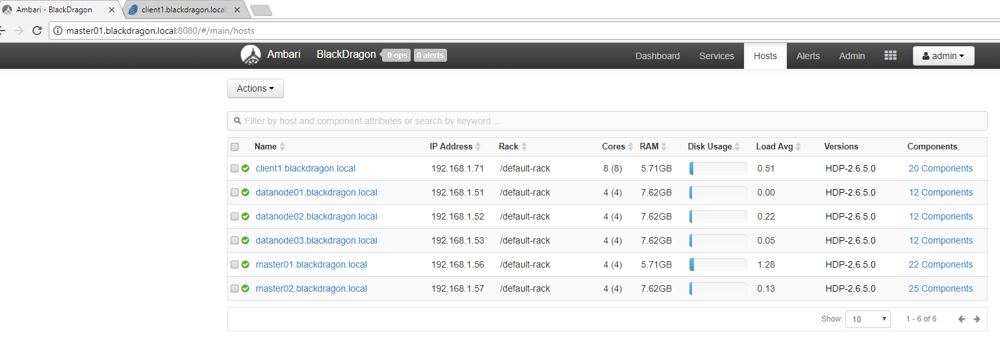
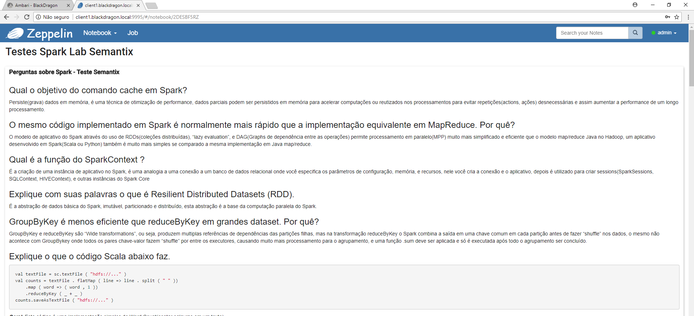

## Desafio Engenheiro de dados

### Setup Lab para o teste de Engenharia de Dados
**Configuração**: Apache Ambari 2.6.2.0 cluster com 6 máquinas virtuais em VMWARE, 2 masters, 1 EdgeNode e 3 datanodes.

### Ambiente de execução Spark
**Ambiente de desenvolvimento Spark**: Apache Zeppelin Notebooks
 - Foi utilizado o Apache Zeppelin como ambiente de desenvolvimento devido a seu amplo suporte ao Apache Spark, os Notebooks possuem suporte a vários interpretadores, configuração simples e ótima documentação, com muitos Notebooks de exemplo disponíveis para aprendizado, suporte a exportar e importar os Notebooks em formato JSON, facilitando o seu compartilhamento, os parágrafos servem como separadores que simulam o pipeline do job a ser implementado em produção, mas o aplicativo suporta o agendamento de Jobs, facilitando a execução de POC completo para um projeto de Spark.

### Respostas do Teste
**Os arquivos do teste estão em dois arquivos**:
 - Arquivo JSON exportado do Apache Zeppelin que corresponde ao código final do teste, o mesmo pode ser importado em qualquer Zeppelin 0.7.3+ configurado com acesso a uma instalação Apache Spark 2.
    - [Zeppelin JSON Export](https://github.com/rickurz/big_data_labs/blob/master/Semantix/Testes%20Spark%20Lab%20Semantix.json)
 - Arquivo PDF com a saída da execução contendo no primeiro parágrafo as respostas das perguntas do teste, e em seguida os parágrafos com a execução passo a passo da solução do exercício de análise dos Logs da Nasa proposto.
    - [Respostas Teste Semantix Ricardo](Zeppelin_Output_Teste_Spark_Semantix_RicardoKurz.pdf)

***Notas***
O seguinte site foi utilizado para teste das expressões regulares, um excelente recurso: https://regexr.com/
